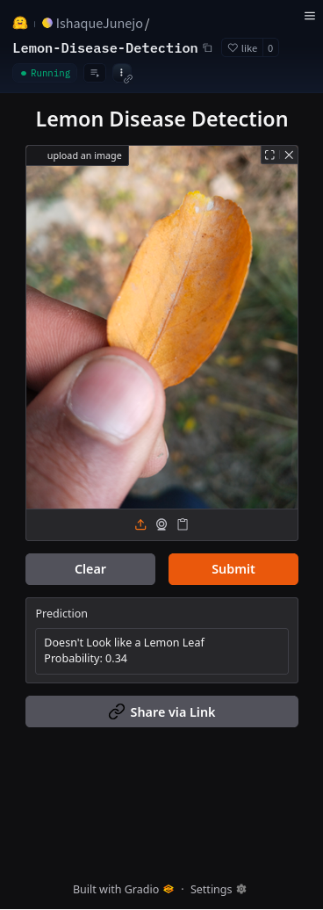
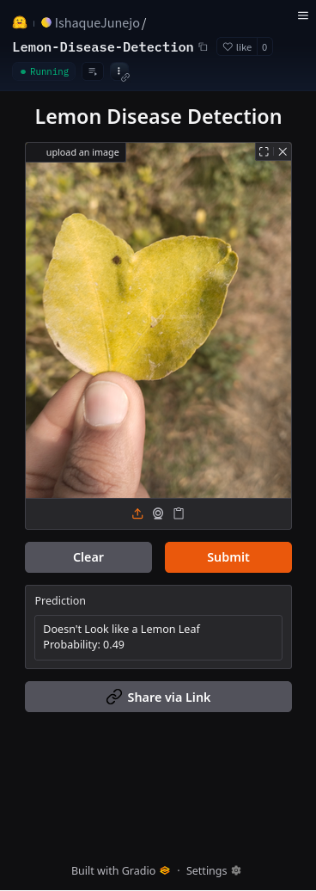
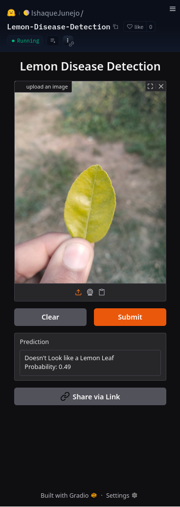
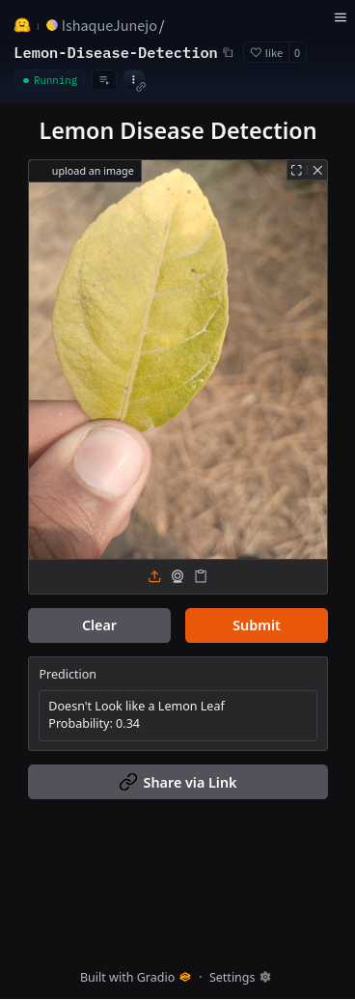
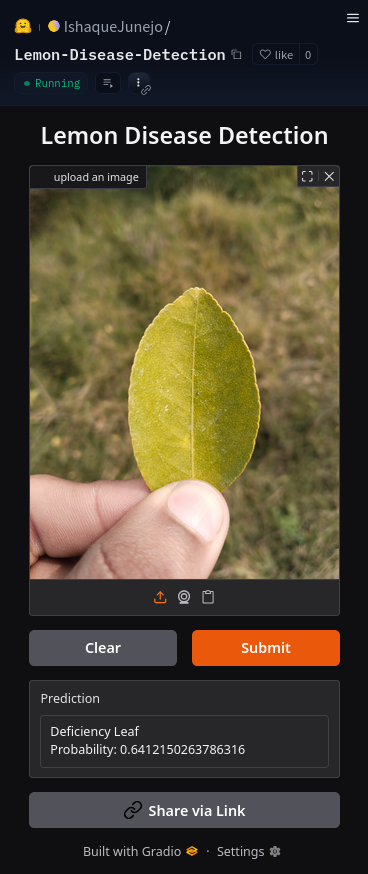
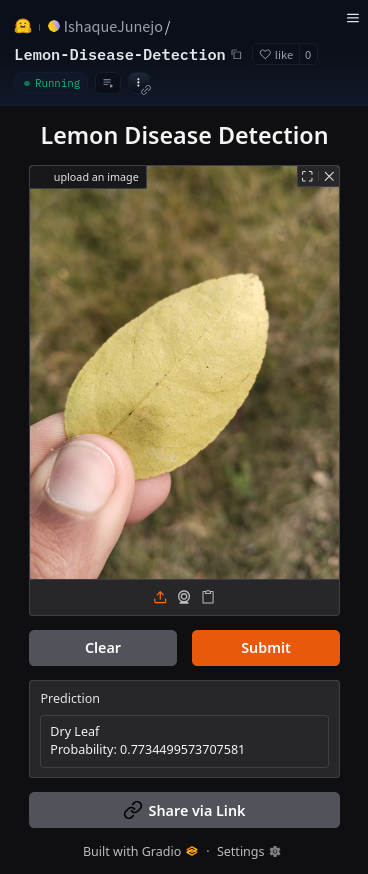

# Field Test Analysis

A demo field test of the pipeline has been made using the [Gradio Space](https://huggingface.co/spaces/IshaqueJunejo/Lemon-Disease-Detection) on a single lemon farm in District Larkana, Pakistan.
The field test is based on only 68 images of Lemon leaves.

Overall the pipeline shows reasonable behaviour on visually clear, and front-facing leaves, but the field test has a significant number of leaves that were far from the clean dataset of the training data taken from [Lemon Leaf Disease Dataset](https://www.kaggle.com/datasets/mahmoudshaheen1134/lemon-leaf-disease-dataset-lldd) from Kaggle.

## Observed failure patterns:
* When the backside of the leaf is shown, it is highly likely to be classified as **Dry Leaf**. This is likely caused from the dataset bias, as most of the images in the training data are front-facing leaves.
* Almost *13 out of 68 leaf images* were classified as **Not a Lemon Leaf**, despite being collected directly from lemon trees.
* **Deficiency Leaf** was more common than I anticipated based on the training data distribution. This happened either because of improper lighting during the field-test, or because Nutrient deficiency was actually common in that farm. Can't be certain as no expert was consulted in this field-test.
* Holding the leaf in the pinch and suspended in sunlight gave noticeable improved predictions compared to keeping the leaf on the palm of the hand, especially to avoid mislabelling **Healthy Leaf** as **Deficiency Leaf**. This suggests the sensitivity to the direction of the camera and light. This is the reason why no images of Leaf laying on the palm is included in this repository, as almost all of them resulted in inconsistent predictions, showing a known failure mode of the model/pipeline.

## Sample Screenshots

* ### Some examples of **Not a Lemon Leaf** mislabelling

* ### An example of labelling the backside of the leaf as **Dry Leaf**

Both of these images are of the same leaf, the first one is the front side of that leaf, and the second one is the back side of that leaf.
The front side is labelled as **Deficiency Leaf**, and the back side is labelled as **Dry Leaf**.

**Side Note**: This field-test was done as a test of the Inference on the free Gradio Space, this is not an exhaustive test and analysis of the model/pipeline.
